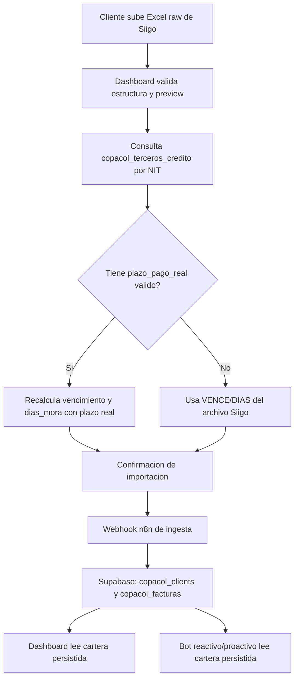

# COPACOL Dashboard - reporte tecnico de plazo real

Fecha: 2026-05-14  
Repo: `SINAPSIO-COPACOL-DASHBOARD`  
Commit base del cambio: `00d49fd`

## 1. Contexto del cambio

COPACOL confirmo que el plazo de pago operativo no siempre coincide con el vencimiento que viene en la cartera exportada desde Siigo. Ese plazo real fue entregado en un Excel de terceros y cargado a Supabase en la tabla:

```text
copacol_terceros_credito
```

El dashboard, el bot y los flujos n8n deben usar esa tabla como fuente preferente para calcular la mora real.

Regla de negocio:

1. Identificar el cliente por NIT.
2. Buscar el NIT en `copacol_terceros_credito`.
3. Si existe `plazo_pago_real` valido:
   - `fecha_vencimiento_real = fecha_emision_factura + plazo_pago_real`;
   - `dias_mora_real = fecha_corte_archivo - fecha_vencimiento_real`;
   - estado `vencida` si `dias_mora_real > 0`, si no `vigente`.
4. Si no existe plazo real para el NIT:
   - usar `VENCE` y `DIAS` del archivo original de Siigo.

El objetivo operativo es que COPACOL suba el archivo raw de Siigo, sin formulas, sin columnas calculadas manualmente y sin preparar la mora por fuera del sistema.

## 2. Archivos modificados

```text
app.py
static/app.js
docs/REPORTE_PLAZO_REAL_DASHBOARD.md
```

No se modificaron credenciales, variables `.env`, tokens ni URLs sensibles.

## 3. Cambios en `app.py`

### 3.1 Lectura flexible de service key

Antes el dashboard solo leia:

```text
SUPABASE_SERVICE_ROLE_KEY
```

Ahora acepta cualquiera de estas variables, en este orden:

```text
SUPABASE_SERVICE_ROLE_KEY
SUPABASE_SERVICE_ROLE
SUPABASE_SERVICE_KEY
```

Motivo: en el workspace COPACOL y en algunos scripts historicos se usan nombres distintos para la misma llave server-side. Esto evita que el dashboard falle localmente o en despliegue por diferencia de nombre, sin exponer la llave en frontend.

### 3.2 `parse_xlsx()` ahora soporta dos rutas

La funcion `parse_xlsx(path)` valida el Excel antes de confirmar la importacion.

Ruta A, local:

- Si existe `../Copacol/cartera_to_supabase.py`, lo usa como transformador completo.
- Esto mantiene compatibilidad con el workspace local donde vive toda la logica COPACOL.

Ruta B, despliegue:

- Si el repo del dashboard esta desplegado solo, sin la carpeta hermana `Copacol`, usa un parser interno.
- Esta ruta fue agregada para evitar que produccion dependa de archivos que no estan dentro del repo desplegado.

### 3.3 Parser interno de cartera

Se agregaron helpers para leer y normalizar el XLSX sin depender de pandas:

```text
parse_date_cell()
days_between()
add_days()
detect_report_date()
normalized_header()
find_header_index()
find_header_col()
safe_cell()
credit_terms_by_nit()
condition_from_days()
```

El parser interno ahora:

- abre el `.xlsx` como zip y lee XML de Excel;
- soporta shared strings;
- detecta la fila de encabezados en las primeras 30 filas;
- soporta el formato completo de Siigo de 20 columnas;
- soporta el formato nuevo/compacto de 15 columnas;
- detecta fechas como serial Excel y como texto tipo `MAY/13/2026`;
- descarta subtotales y filas no operativas;
- filtra tipos de movimiento validos cuando el archivo trae esa columna;
- conserva notas/saldos negativos como saldos a favor dentro del saldo neto.

### 3.4 Conexion con `copacol_terceros_credito`

El parser consulta:

```text
copacol_terceros_credito
```

Campos usados:

```text
nit
plazo_pago_real
condicion_key
condicion_credito
```

La consulta se hace server-side con Supabase REST usando la service key configurada en entorno. No se imprime ni retorna ningun secreto.

### 3.5 Recalculo de vencimiento y mora

Para cada factura:

Si hay match por NIT y `plazo_pago_real > 0`:

```text
fecha_vencimiento = fecha_emision + plazo_pago_real
dias_mora = fecha_corte - fecha_vencimiento
condicion_pago = condicion_key si existe, si no se deriva del plazo
plazo_pago_fuente = copacol_terceros_credito
```

Si no hay match:

```text
fecha_vencimiento = VENCE del archivo
dias_mora = DIAS del archivo o calculado contra VENCE
condicion_pago = derivada del plazo original
plazo_pago_fuente = cartera_original
```

### 3.6 Preview con auditoria de cobertura

El preview de carga ahora incluye:

```json
"plazo_real": {
  "fuente_facturas": {
    "copacol_terceros_credito": 1016,
    "cartera_original": 327
  },
  "clientes_con_plazo_real": 413,
  "clientes_sin_plazo_real_fallback_cartera": 31
}
```

Esto permite al equipo ver cuantos documentos se calcularon con plazo real y cuantos quedaron en fallback.

### 3.7 Correccion de estado en fallback directo

En la ruta de importacion directa, el estado de factura vencida ahora se escribe como:

```text
vencida
```

Antes podia salir como:

```text
vencido
```

La tabla `copacol_facturas` y los flujos esperan `vencida`/`vigente`, por eso se corrigio.

Nota: la ruta productiva de escritura es n8n mediante `N8N_IMPORT_WEBHOOK_URL`. El dashboard valida el archivo y envia el XLSX al flujo; no debe escribir cartera directamente en Supabase.

## 4. Cambios en `static/app.js`

### 4.1 Tarjetas de cliente

Las tarjetas de clientes ahora muestran:

```text
Condicion real + Plazo real N dias + Cupo
```

Ejemplo:

```text
COPACOL 45 dias · Plazo real 45 dias · Cupo $...
```

Si no hay plazo real, se muestra la condicion disponible o `Sin condicion real`.

### 4.2 Drawer/detalle de cliente

El drawer ahora incluye una fila especifica:

```text
Plazo real: 45 dias
```

Si no hay plazo real:

```text
Plazo real: Fallback cartera
```

Esto hace explicito para el usuario que el calculo se baso en el archivo de cartera original porque no hubo match valido en terceros.

### 4.3 Preview de carga

El preview de importacion ahora muestra una metrica adicional:

```text
Plazo real: X docs
Y fallback
```

Esto ayuda a detectar problemas de match de NIT o faltantes en la tabla de terceros antes de confirmar la carga.

## 5. Validaciones realizadas

Se valido sintaxis Python:

```bash
python -m py_compile app.py
```

Se validaron dos archivos reales de cartera:

| Archivo | Clientes | Facturas | Saldo neto | Fecha corte | Docs con plazo real | Docs fallback |
| --- | ---: | ---: | ---: | --- | ---: | ---: |
| `CARTERA GENERAL 06-05-2026.xlsx` | 438 | 1351 | 1,293,552,909.53 | 2026-05-06 | 984 | 367 |
| `CARTERA GENERAL 13-05-2026 NUEVO.xlsx` | 444 | 1343 | 1,326,597,074.89 | 2026-05-13 | 1016 | 327 |

Tambien se valido el parser desde una copia temporal del dashboard sin acceso a la carpeta hermana `Copacol`. Resultado: el repo desplegado puede validar los dos formatos por si mismo.

Validacion de lectura live desde Supabase:

```text
fecha_corte: 2026-05-13
clientes: 444
facturas: 1343
```

Se verifico que `build_client_payload()` ya retorna en el detalle del cliente:

```text
plazo_pago_real
condicion_pago_real
condicion_credito
cupo_credito
observacion_credito
```

## 6. Relacion con n8n y bot

La arquitectura esperada queda asi:



Punto importante: los flujos reactivo y proactivo no deberian recalcular la mora con la fecha actual. Deben leer `dias_mora`, `total_vencido`, `total_vigente` y `fecha_vencimiento` ya persistidos desde la ingesta.

## 7. Que significa `sin_condicion_real`

`sin_condicion_real` no significa necesariamente error.

Significa que para ese NIT no se encontro un plazo real valido en:

```text
copacol_terceros_credito.plazo_pago_real
```

En ese caso se usa fallback a la cartera original de Siigo. Posibles causas:

- el NIT no existe en `copacol_terceros_credito`;
- el NIT existe con formato distinto;
- el registro existe pero `plazo_pago_real` esta vacio o no es numerico;
- el cliente realmente no tiene plazo negociado registrado.

## 8. Instruccion para COPACOL

COPACOL debe subir el archivo exportado desde Siigo, sin formulas ni columnas manuales.

Columnas minimas requeridas:

```text
NIT
NOMBRE
DOCUMENTO
FECHA
VENCE
DIAS
SALDO
```

Columnas adicionales aprovechadas cuando existen:

```text
CIUDAD
VENDED
TEL_1
TEL_2
DIRECCION
CUENTA
VLR MORA
```

El sistema se encarga de cruzar contra terceros y calcular la mora real.

## 9. Riesgos y cuidados para futuros cambios

- No exponer `SUPABASE_SERVICE_ROLE_KEY` ni equivalentes en frontend.
- No reemplazar tokens de Chatwoot por tokens de Twilio.
- No hacer llamados a Twilio desde el dashboard para validar cartera.
- Mantener `N8N_IMPORT_WEBHOOK_URL` configurado en produccion; esa es la ruta oficial de escritura.
- Si se cambia el esquema de `copacol_terceros_credito`, revisar `credit_terms_by_nit()`.
- Si Siigo cambia nombres de columnas, revisar `find_header_col()` y los aliases de encabezados.
- Si se modifica la ingesta n8n, validar de nuevo con los dos archivos historicos usados en este reporte.

## 10. Checklist rapido para otro developer

Antes de aprobar un cambio futuro:

1. Correr `python -m py_compile app.py`.
2. Validar preview con `CARTERA GENERAL 06-05-2026.xlsx`.
3. Validar preview con `CARTERA GENERAL 13-05-2026 NUEVO.xlsx`.
4. Confirmar que `plazo_real.fuente_facturas` no quede todo en fallback.
5. Confirmar que el dashboard muestre `Plazo real` en tarjeta y drawer.
6. Confirmar que la ruta productiva use `N8N_IMPORT_WEBHOOK_URL`.
7. Revisar que no se haya impreso ningun secreto en logs, reportes o commits.
